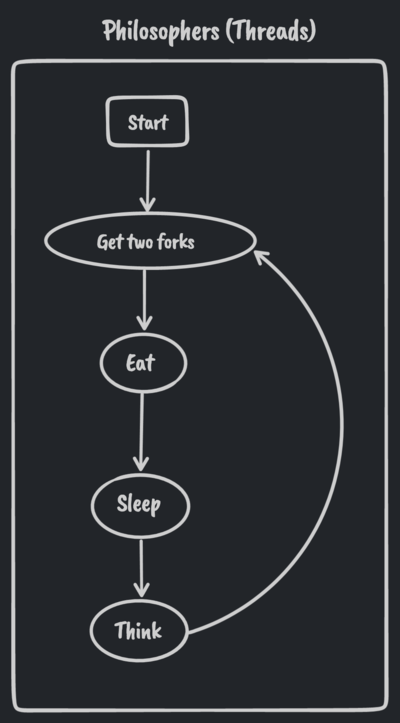
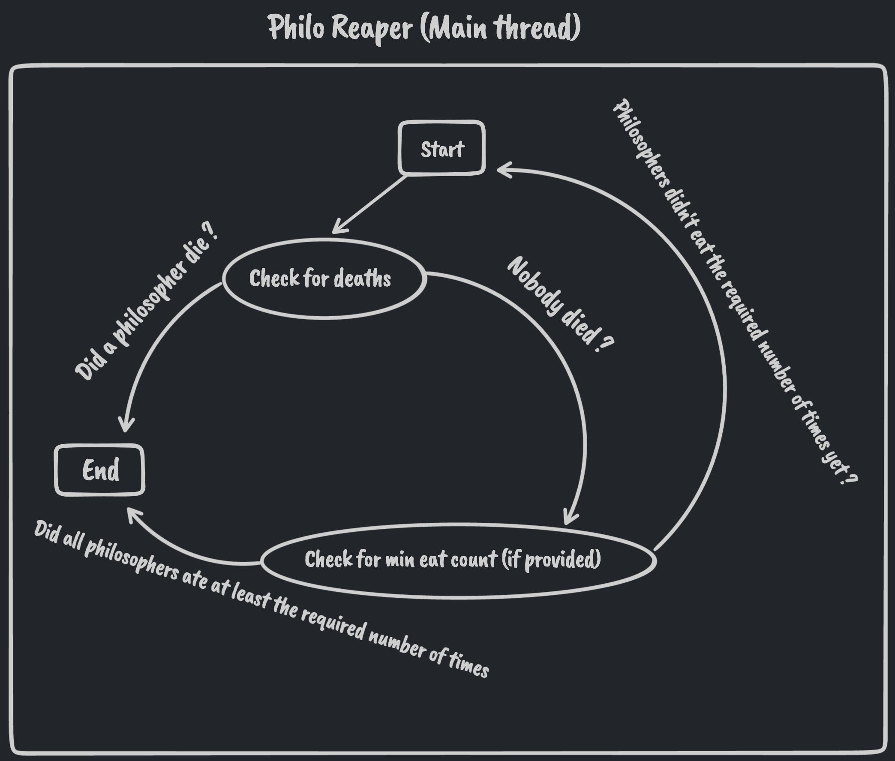

# Philosophers

Philosophers is an implementation of the ***Dining Philosophers*** synchronization problem via multi-threading (Using the pthread API)

## Philosophers (threads activity)


## Main thread activity


## Usage
```sh
make
./philo philo_num death_time eat_time sleep_time [min_eat_count]
```

[](https://forthebadge.com)